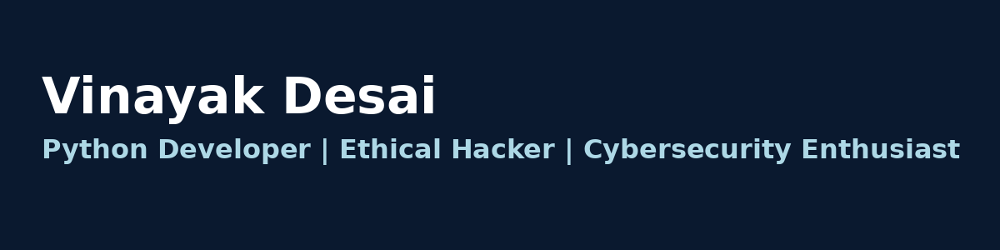

<h1 align="center">Hey 👋, I'm Vinayak</h1>
<h3 align="center">Python Developer | Ethical Hacker | Cybersecurity Enthusiast</h3>

  

---

### 💼 About Me:
- 🔐 I’m focused on ethical hacking, especially web/mobile application security.
- 🧰 I build tools in Python for penetration testing and automation.
- 🧠 Currently learning: malware analysis, advanced Linux security, and offensive tooling.
- ⚡ Fun fact: I automate everything possible, even my coffee machine ☕

---

### 📫 Connect with Me:
- 🔗 LinkedIn: [desai-vinayak-90ba8b333](https://www.linkedin.com/in/desai-vinayak-90ba8b333)
- ✉️ Email: [desaivinayak449@gmail.com](mailto:desaivinayak449@gmail.com)

---

### 🛠️ Languages & Tools:

---

### 📷 Banner (Optional)

  

---

⭐️ Thanks for visiting my profile!
